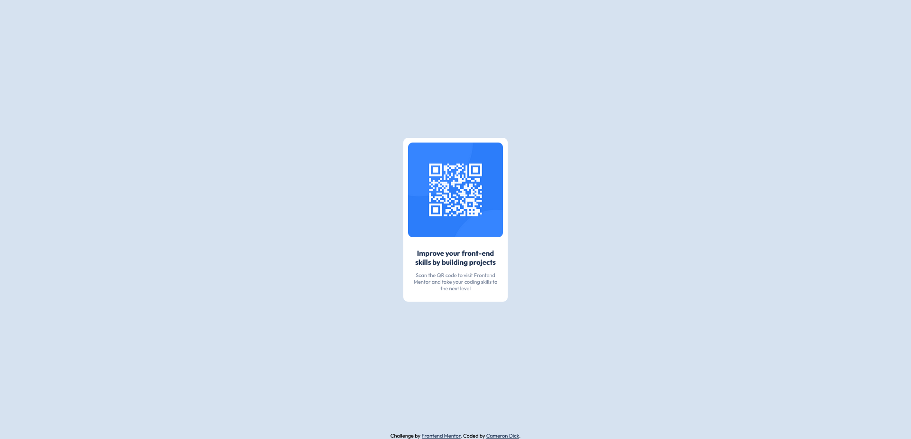

# Frontend Mentor - QR code component solution

This is a solution to the [QR code component challenge on Frontend Mentor](https://www.frontendmentor.io/challenges/qr-code-component-iux_sIO_H). Frontend Mentor challenges help you improve your coding skills by building realistic projects. 

## Table of contents

- [Overview](#overview)
  - [Screenshot](#screenshot)
  - [Links](#links)
- [My process](#my-process)
  - [Built with](#built-with)
  - [What I learned](#what-i-learned)
  - [Continued development](#continued-development)
  - [Useful resources](#useful-resources)
- [Author](#author)

## Overview

### Screenshot



### Links

- Solution URL: [Add solution URL here](https://your-solution-url.com)
- Live Site URL: [Add live site URL here](https://your-live-site-url.com)

## My process

### Built with

- HTML5 markup
- CSS 3

### What I learned

I learned how to properly center an element on screen.
To my understanding, you center the top left corner of your element then apply a translation, mapping the center of the object to the center of the page.

Example code snippet below:

```css
.container {
  background-color: #ffffff;
  text-align: center;
  width: 200px;
  height: auto;
  padding: 10px;
  border-radius: 10px;
  /*Shifts left hand corner of container to middle of screen*/
  position: absolute;
  /*Percentage values allows page to be scaled while maintaining position*/
  left: 50%;
  top: 50%;
  /*Translate center of container to centre of screen*/
  transform: translate(-50%, -50%);
  /*Setup font for child containers..? i.e each sub-container should have font family [name]*/
  font-family: 'Outfit', sans-serif;
}
```

### Continued development

I will continue to focus on: 
    A: proper use of comments/commenting... Im not entirely certain on the etiquette of comments and what to really include in them.
    B: Establishing a proper workflow/method. It was my first project and I found myself bouncing back between layers of CSS and html.
    C: Use of the div element, and inheritance on the css side.

### Useful resources

- [Centering Div Elements](https://blog.hubspot.com/website/center-div-css) - This was the article that finally got it to click. It helped me for center div elements reason. It also expands further with centering divs within divs and text.
- [Centering an Element](https://css-tricks.com/quick-css-trick-how-to-center-an-object-exactly-in-the-center/) - This short article illustrates the process of centering elements perfectly. It is a very short read but is well worth it for a visual understanding.

## Author

- Website - [Cameron Dick](https://ctdck.github.io/CurriculumVitae/)
- Frontend Mentor - [@CTDck](https://www.frontendmentor.io/profile/CTDck)
- Twitter - [@yourusername](https://www.twitter.com/yourusername)

